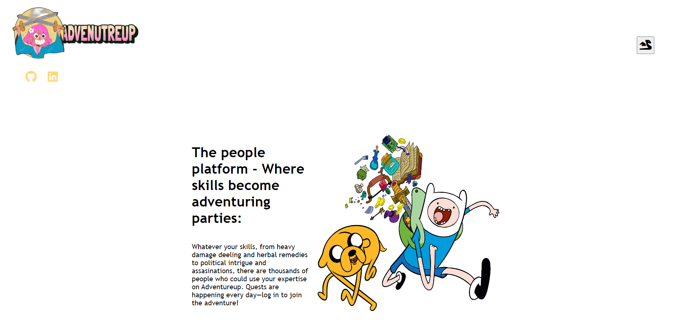
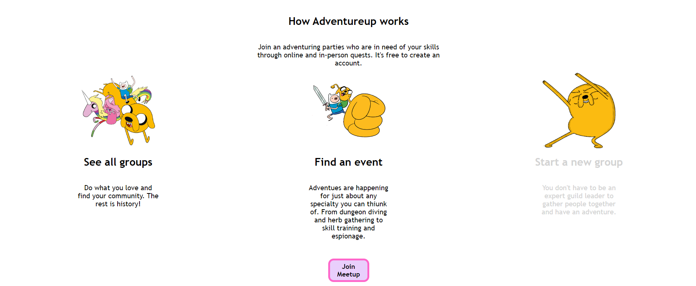
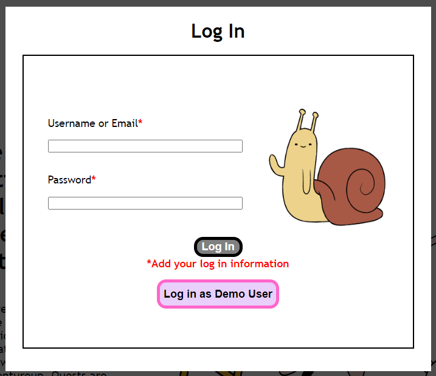
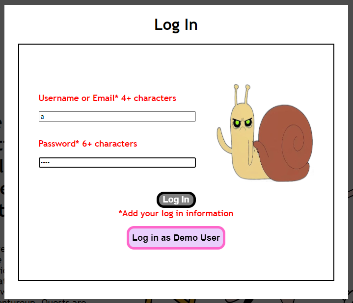
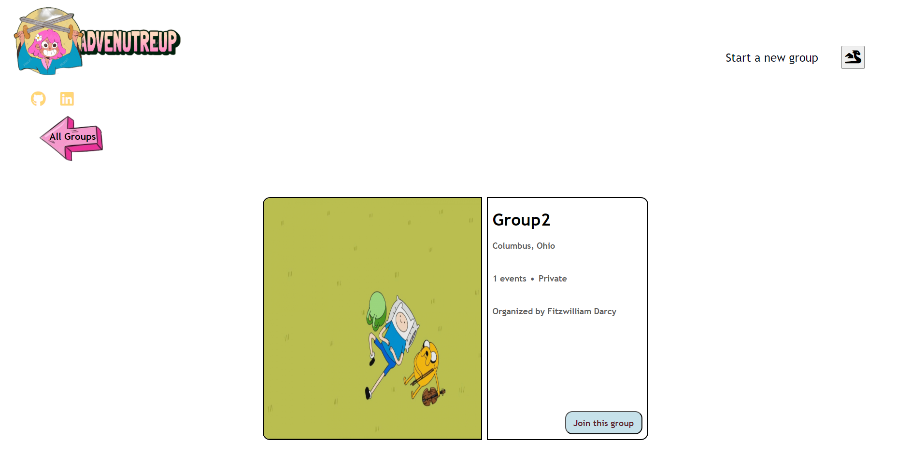
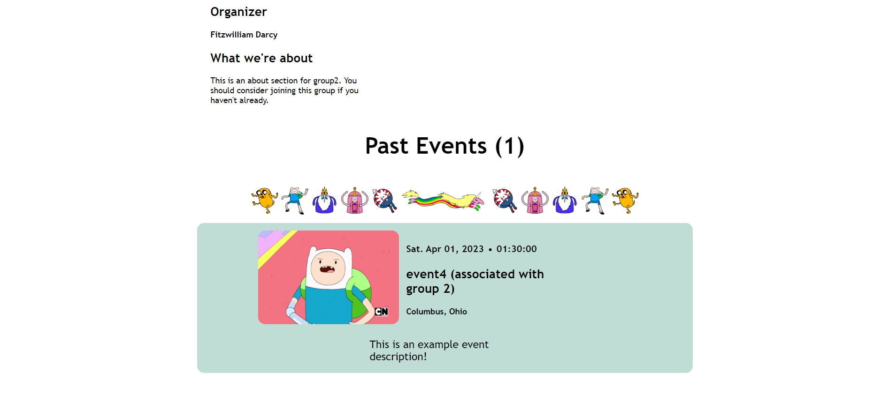

# AdventureUp
<!-- Intro -->
AdventureUp is a light MeetUp clone. There is 1 full CRUD feature and 1 partial CRUD featuer. (CRD)
AdventureUp is designed to let you sign up as a memeber of the website, or use the demo user, look at the groups and events in the db.
After you have signed in you will be able to create groups (and then events), and edit any groups you have created. You will also be able to delete both groups and events that you have created.

<!-- Technologies -->
## Technologies Used
- React/Redux frontend
- SQLite3/PostgreSQL backend
- JavaScript, HTML, CSS
- FontAwesome icon

<!-- Image for project -->
## Homepage

## Login

## All Groups Page

## Group Page

## Getting started
AdventureUp
<!-- instructions on how to launch application locally -->
In the frontend and backend folders npm install.

npm start both the frontend and backend folders.

# Features
## Groups
    - Authorized user can create a group
    - Any user can view all of the groups
    - Authorized user can edit a group
    - AUthoirzed user can delete a group

## Events
    - Authorized user can create an event
    - Any user can view all events

## Contributors

Contributors:

Michael Guidera https://github.com/TheSicilian12
